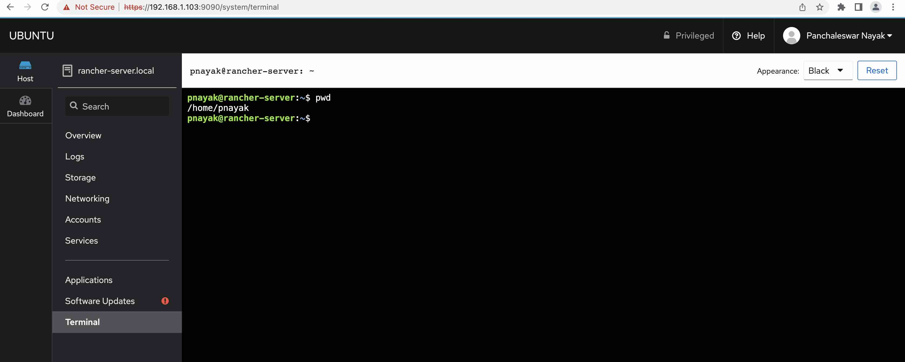

# My Technology Learning and Blog

## Installing Rancher on k3s

Clone existing "Ubuntu 20" VM on VirtualBox , Run the VM and Update the OS packages, you can install cockpit to update and install packages

```
apt update
apt install -y cockpit
```
Access the VM web Interfase using the http//"ip-address":9090



## Setting DNS for the VM

setup your DNS record for your domain

You can create a new NS record which points to "ns-aws.sslip.io." , this will bassically return the IP adress as the domain name. like if you try to get the domain name 192.168.1.100.bigopencloud.pnayak.com, it ll return you the IP address 192.168.1.100.

IP_ADDRESS.bigopencloud.pnayak.com


## Install HELM
```
curl -fsSL -o get_helm.sh https://raw.githubusercontent.com/helm/helm/main/scripts/get-helm-3
chmod 700 get_helm.sh
./get_helm.sh
```
## Install lubernetes CLI ubectl

Download and install kubectl the Kubernetes CLI with whom you can communicate with Kubernetes Cluster

```
curl -LO "https://dl.k8s.io/release/$(curl -L -s https://dl.k8s.io/release/stable.txt)/bin/linux/amd64/kubectl"chmod +x kubectl
mv kubectl /usr/local/bin
```

## Install k3s, the lightweight Kubernetes

Install k3s server without the traefik ingress controller, we are going to install and use nginx ingress controller latter.
```
curl -sfL https://get.k3s.io | INSTALL_K3S_EXEC="--no-deploy traefik" sh -s -
```

## Install Rancher on k3s

Excute the shell script

```
./rancher/install-rancher.sh
```

Now wait for the Rancher server to be up and running

```
sudo kubectl get pods --all-namespaces | grep helm
sudo kubectl get secret --namespace cattle-system bootstrap-secret -o go-template='{{.data.bootstrapPassword|base64decode}}{{"\n"}}'
```

## Uninstall k3s singlenode kubernetes cluster from the VM

Igf you need to uninsatll the k3s Server from the VM you can do so just excuting the following command
```
sudo /usr/local/bin/k3s-uninstall.sh
```


