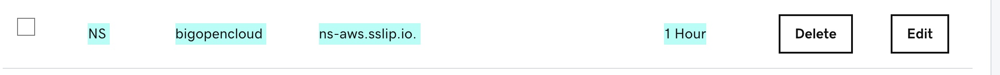

# My Technology Learning and Blog

## Installing Rancher on k3s

Here I am using VMware Fusion on my MAcbookPro to create and manage the VMs, you can use any virtualization software for your laptop or desktop.


Clone your existing "CentOS 7" or "Ubuntu 20" VM on VirtualBox , Run the VM and Update the OS packages, you can install cockpit to update and install packages.

For CentOS 7
```
sudo yum update -y
sudo yum install -y cockpit
```

for Ubuntu 20

```
sudo apt update
sudo apt install -y cockpit
```
Access the VM web Interfase using the http//"ip-address":9090


## Setting DNS for the VM

setup your DNS record for your domain

You can create a new NS record which points to "ns-aws.sslip.io." , this will bassically return the IP adress as the domain name. like if you try to get the domain name 192.168.1.100.bigopencloud.pnayak.com, it ll return you the IP address 192.168.1.100.

IP_ADDRESS.bigopencloud.pnayak.com



## Install HELM
```
curl -fsSL -o get_helm.sh https://raw.githubusercontent.com/helm/helm/main/scripts/get-helm-3
chmod 700 get_helm.sh
./get_helm.sh
```
## Install lubernetes CLI ubectl

Download and install kubectl the Kubernetes CLI with whom you can communicate with Kubernetes Cluster

```
curl -LO "https://dl.k8s.io/release/$(curl -L -s https://dl.k8s.io/release/stable.txt)/bin/linux/amd64/kubectl"
chmod +x kubectl
sudo mv kubectl /usr/local/bin
```

## Install k3s, the lightweight Kubernetes

Install k3s server without the traefik ingress controller, we are going to install and use nginx ingress controller latter.
```
curl -sfL https://get.k3s.io | INSTALL_K3S_EXEC="--no-deploy traefik" sh -s -
```
Get the Kubernetes cluster details
```
sudo k3s kubectl get nodes
sudo k3s kubectl describe all
```

If you dont want to excute the "k3s kubectl" and use only kubectl to get communicate to the cluster do the following
```
sudo cp /etc/rancher/k3s/k3s.yaml ~/.kube/config
sudo chown pnayak ~/.kube/config
```
To tesrt the config simple excute
```
kubectl get nodes
```

## Install Rancher on k3s

Excute the shell script
```
./rancher/install-rancher.sh
```
Check the status of the pods
```
kubectl get pods --all-namespaces | grep helm

pnayak@rancher-server:~$ kubectl get pods --all-namespaces | grep helm
cert-manager                helm-install-cert-manager--1-g9k9k        0/1     Completed          0             16m
cattle-system               helm-operation-dhxsx                      0/2     Completed          0             14m
cattle-system               helm-operation-nx54x                      0/2     Completed          0             14m
kube-system                 helm-install-ingress-nginx--1-7762k       0/1     Completed          4             16m
cattle-system               helm-operation-dhr9k                      0/2     Completed          0             14m
cattle-system               helm-install-rancher--1-wq9w7             0/1     CrashLoopBackOff   6 (53s ago)   7m1s
```

Wait for the Rancher server to be up and running,now the the following url on your local the browser
https://IP_ADDRESS.bigopencloud.pnayak.com


Get the bootstrap password by excuting the following
```
kubectl get secret --namespace cattle-system bootstrap-secret -o go-template='{{.data.bootstrapPassword|base64decode}}{{"\n"}}'
```
Copy the pawword and paste it on the browser as the bootstrap password
```
pnayak@rancher-server:~$ kubectl get secret --namespace cattle-system bootstrap-secret -o go-template='{{.data.bootstrapPassword|base64decode}}{{"\n"}}'
6gp5fpqk9b7ffjlr2zd446v5b5gjv4vrztwz5bcjdrzpv8jq59f459
```
Now se your own password for the rancher server as shown 


Login to rancher server with admin as the username and your password, you should be able to login successfully.


## Uninstall k3s singlenode kubernetes cluster from the VM

Igf you need to uninsatll the k3s Server from the VM you can do so just excuting the following command
```
sudo /usr/local/bin/k3s-uninstall.sh
```


