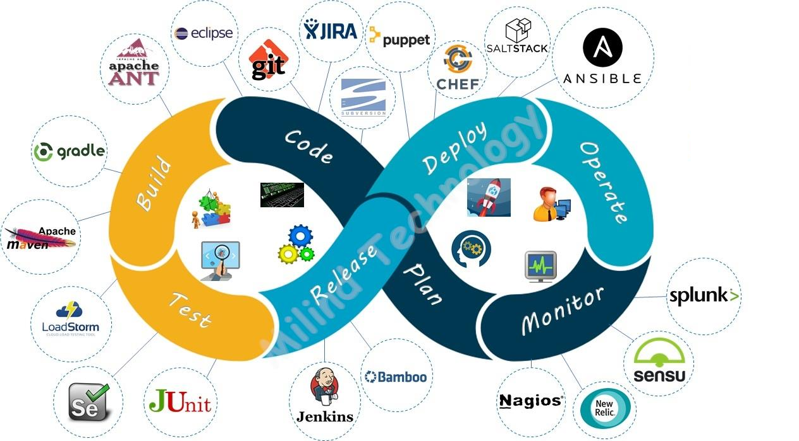

# This is my DevOps Blog

## DevOps Tools

### Prject Planning

[Jira]()

### Coding

[MS-Code]()
[Git]()

### Build Tools
[Maven]()
[Graddle]()

### Testing Tools

[JUnit]()
[Sonarqube]()
[Selenium]()

### CI Tools

[Jenkins]()
[GitLab]()
[Teamcity]()
[CircleCI]()

### Release Management Tools

[Artifactory]()
[Naxus]()

### Contineous Deployment Tools

[Terraform]()
[Ansible]()
[Harness]()

### Deploment Platforms

[Docker](deployment/docker/README.md)

[Kubernetes](deployment/kubernetes/README.md)

[Linux-VM](/linux/README.md)

### Monitiring Tools

[Promethious]()
[Grafana]()
[AppDynamics]()
[Dynatrace]()
[NewRelics]()
[ELK-Stack]()
[Nagios]()

## DevOps Pipeline

-> Planing - > Codeing - > Testing - > Building - > Release - > Deployment - > Operation - > Monitoring - > 

